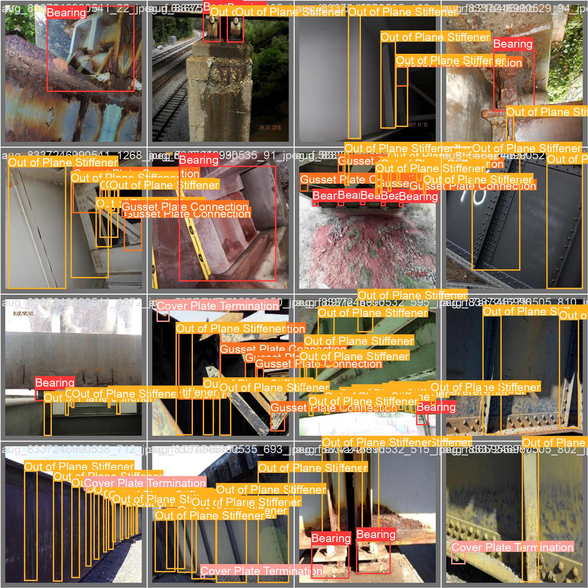

# 🏗️ From Bridges to Smart Infrastructure — CBV & Infravision with YOLOv9

**CBV** (City Bridge Vision) was initially developed to detect structural defects in **bridges** only.  
The scope was narrow.

## 🚀 Project Evolution

The project evolved into a **Smart Infrastructure Vision** system.  
We expanded CBV to detect damage in various types of infrastructure, which brought a significant challenge:  
**collecting and preparing diverse datasets** for multiple infrastructure components.

###  Supported Infrastructure Classes

- 🏗️ Bridges  
- 🏢 Buildings  
- 🛣️ Roads  
- 🌪️ Wind Turbines  
- 🚆 Railways  
- ⚡ Power Lines  

##  Data Preprocessing & Augmentation

To boost the model's accuracy and generalization, we applied:

- **Data Cleaning & Normalization**  
- **Resizing images to YOLOv9 input size**  
- **Augmentation**: flips, brightness, blur, noise, shadows.

These techniques allowed us to create a robust and diverse dataset across infrastructure types.

## 🧠 Model Used: YOLOv9

We used **YOLOv9**, the latest version in the YOLO family, for its:

-  High speed and accuracy  
-  Real-time multi-class object detection  
-  Compatibility with infrastructure defect detection tasks

## 📊 Results

The model detects various defect types such as:

- Cracks  
- Surface deformation  
- Corrosion  
- Missing or broken elements

### 📸 Sample Outputs

Detection results from the YOLOv9 model:

- 🏗️ **Bridge Defect Detection:**  
  

- 🏢 **Infrastructure Damage Detection (1):**  
  

- 🛣️ **Infrastructure Damage Detection (2):**  
  

## 🌐 Future Work

- Integration with real-time CCTV or drone footage  
- Automatic alerts for severe defects  
- A dashboard to visualize all detections on a city map

